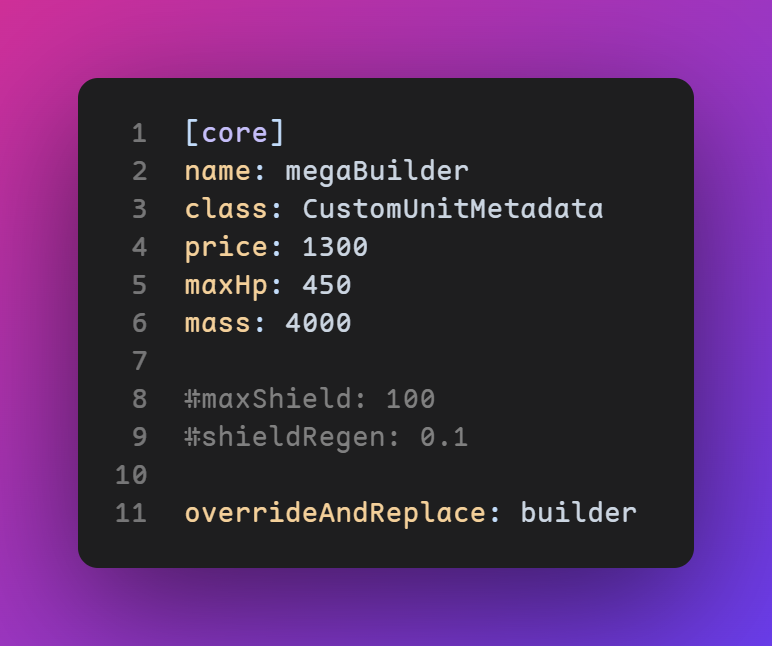

# Rusted Warfare Support

A [VSCode extension](https://marketplace.visualstudio.com/VSCode) that provides workspace detection, syntax
highlighting, code completion and format checker
for [Rusted Warfare](http://corrodinggames.com/rusted_warfare).

## Features

(Will be) powered by the [Rusted Warfare Language Server](https://github.com/yvvki/RWLS.git).

> ## ⚠️ IN DEVELOPMENT! 
>
> Currently is being heavily developed. Contribution is welcome!
> 
> Check out the [issues](https://github.com/yvvki/rusted-warfare-vscode/issues)
> and [pull requests](https://github.com/yvvki/rusted-warfare-vscode/pulls).

## Release Notes

See the [Changelog](CHANGELOG.md).

## License

This project is distributed under the [MIT License](LICENSE).
